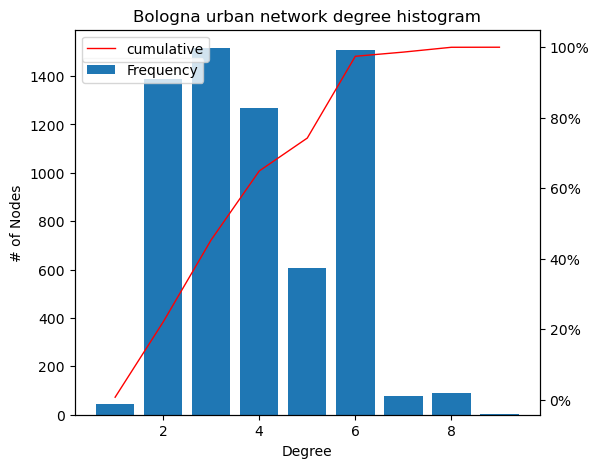

# Bologna Urban Network Analysis
Implementation of a Bologna urban street network analysis using complex network algorithms, with a comparison between real traffic and accident data from _Comune di Bologna_ and our traffic simulation.

All the computations are presented as a jupyter notebook written in *Python*.

# Table of Contents
* [Requirements](#Requirements)
* [Structure](#Structure)
* [Usage](#Usage)
* [Results](#Results)
* [Example images](#Examples)

# Requirements
* Standard python libraries (numpy, matplotlib, tqdm, random, statistics)
* Networkx
* [OSMnx](https://geoffboeing.com/publications/osmnx-complex-street-networks/)

# Structure 
* [`urban_network_analysis.py`](urban_network_analysis.py) is a python file showing connectivity and centrality analysis of Bologna
* [`urban_network_analysis.ipynb`](urban_network_analysis.ipynb) is a notebook showing connectivity and centrality analysis of a chosen city
* [`city_traffic_simulation.py`](city_traffic_simulation.py) is the main python file computing traffic simulation within Bologna, with statistics and animations
* [`city_traffic_simulation.ipynb`](city_traffic_simulation.ipynb) is the main notebook computing traffic simulation within a chosen city, with statistics and animations
* [`utils.py`](utils.py) contains all the functions used in [`urban_network_analysis.py`](urban_network_analysis.py) and [`city_traffic_simulation.py`](city_traffic_simulation.py) 
* [`cars.py`](cars.py) defines the class `Cars`, containing informations of N cars, used inside the simulation
* [`simulation.py`](simulation.py) contains only the traffic simulation function
* [`strade30.txt`](strade30.txt) is a list of Bologna streets used in the `città50` function to set Città50 speed limits

# Usage
To get started, you can clone the repository using the following command:

```bash
git clone https://github.com/MassimoMario/Bologna_urban_network_analysis.git
```

Then make sure to have Networkx and OSMnx installed:

```bash
pip install networkx
```

Please note that you may be able to install OSMnx with `pip` but this is not officially supported, read instead their documentation on [how to install OSMnx](https://osmnx.readthedocs.io/en/stable/installation.html).

Our analysis are shown in two Python files, [`urban_network_analysis.py`](urban_network_analysis.py) and [`city_traffic_simulation.py`](city_traffic_simulation.py). You can just run them:

```bash
python3 urban_network_analysis.py

python3 city_traffic_simulation.py
```
or you can modify the city and the settings acting on the two notebooks according to the notes written inside.

The first code will show a quantitative analysis of an urban street network properties, the city can be freely choosen between tens of cities. It shows first a connectivity analysis followed by a degree histogram and then different plot regarding four centrality measures (_Degree Centrality, Betweenness Centrality, Edge Betweenness Centrality, Closeness Centrality_). 

The function `vulnerability` computes the vulnerability factor of the city after some streets are removed. This factor is taken from the idea behind the _Information Centrality_ (see the report for more details). `vulnerability` works only for _Bologna, Nantes, Edinburgh_ and _Zurich_ since they are the cities taken into consideration in the report for which we found the respective _ZTL_ .Apart from Bologna we included 12 [foreign cities](https://www.bolognacitta30.it/citta-30-nel-mondo/) that already adopted 30zone as speed limits, and 15 [italian cities](https://www.bolognacitta30.it/citta-30-in-italia/) where 30zone is under discussion.


The second jupyter notebook contains the traffic simulation followed by quantitative statistics (_mean speed, mean acceleration, travelling times histogram, total time simulated_) and _three animations_ : cars flowing through the city, speeds through time and accelerations through time. It's designed to work well with Bologna since the report is focused on Bologna urban network traffic, but we recommend to run it with those cities adopting _km/h_ as speed unit of measure (the reason is that the function `clean_graph_data` is called to clean max speed graph data but it crashes with _mph_ speed limits since they would need a different cleaning).

# Results
Table for comparing simulation results between _Città50_ and _Zona30_ speed limit:


|| _Città50_ | _Zona30_ |
|---|---|---|
Mean travelling time | 13m 46s | 17m 13s |
Median travelling time | 12m 40s | 15m 30s |
Mean speed | 25.97 $\frac{km}{h}$ | 17.60 $\frac{km}{h}$ |
Mean acceleration | 3.93 $\frac{km}{h \cdot s}$ | 2.74 $\frac{km}{h \cdot s}$ |
\# Accidents | 962 | 400 |


# Examples
Few example images:


:--:
*Resulting image of *città50* traffic simulation on Bologna*


:--:
*Resulting image of a centrality analysis on Bologna*


:--:
*Bologna degree histogram*
